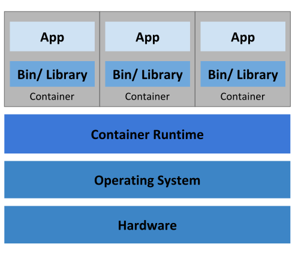

# Containers

**Containers** are an application-centric method to deliver high-performing, scalable applications on any infrastructure of you choice. They provide portable, isolated virtual environments that enable applications to run without interference from other running applications.

A **container image** bundles the code you want to run alongside its runtime, libraries and dependencies. Containers are created from their images. Container images can be based on other images so that your code sits on top of a stack of other, more generic code. As such, container images are composable.

# Container Orchestration

When working locally with containers it is fine to use the containers themselves in something like Docker or Docker Compose. However, when we use containers in deployed environments we usually have additional concerns such as:

- fault tolerance
- on-demand scalablility
- optimal resource usage
- auto-discovery of other services
- communication with other services
- accessiblity from the outside world
- seamless updates/rollbacks without any downtime

**Container orchestrators** are tools that group systems together to form _clusters_ where a container's deployment and management is automated at scale while meeting the requirements mentioned above.

## Example Container Orchestration

- Amazon Elastic Container Service (ECS) - container orchestration at scale on AWS
- Azure Container Instances (ACI) - basic container orchestration provided by Microsoft Azure
- Azure Service Fabric - open source container orchestration provided by Microsoft Azure
- Kubernetes - open source orchestration tool, originally started by Google, now part of the Cloud Native Computing Foundation (CNCF) project
- Marathon - framework to run containers at scale on Apache Mesos and DC/OS
- Nomad - a container and workflow orchestrator provided by Hashicorp
- Docker Swarm - container orchestrator provided by Docker as part of Docker Engine

More knowledge can be gained on container orchestrators in another MOOC called [Introduction to Cloud Infrastructure Technologies](https://learning.edx.org/course/course-v1:LinuxFoundationX+LFS158x+1T2022/home)